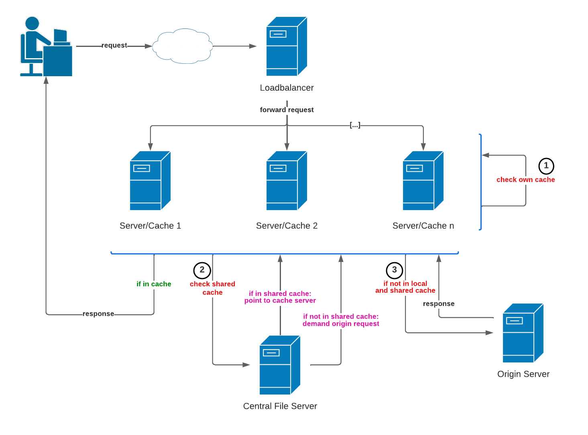
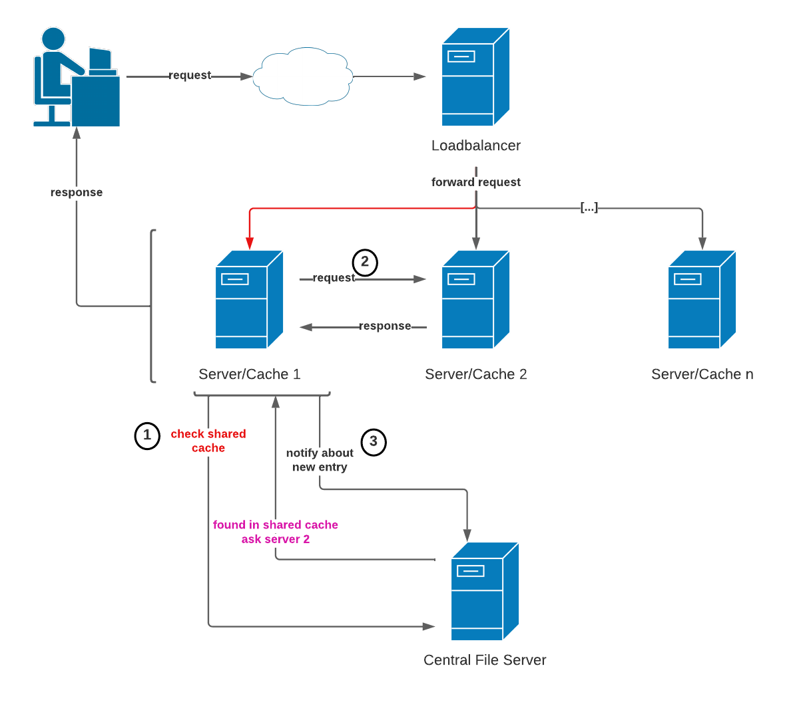

# Content Delivery Network - Software Internship at RWTH Aachen

##  Short introduction

This Content Delivery Network (CDN) project was created during a software internship at the RWTH Aachen University. Its goal was to create a CDN from scratch and conceptualize an approach to achieve qualities like load balancing and fast content delivery.

## The Approach:

Within two local data centers, which contain servers, router, switches and hosts, properties of a CDN were fulfilled. One load balancing server was implemented to distribute requests equally among all given servers within a data center. A central file server was added which points to the cached response. With these two additional servers, the load each server would have to handle was divided evenly, as well as the delivery speed of the lightweight approach was guaranteed. The figure below represents the entire concept in an illustrative manner:

### Workflow

The workflow can be described as following. Firstly, a client makes a request that will always reach the load balancing server. This ”Loadbalancer” functions simultaneously as a nameserver. Its main goal is to distribute requests in an even fashion. The chosen server, e.g. 1, will firstly check its local cache for the existence of the corresponding content. Should that not be the case, the central file server will be contacted. The central file server acts a pointer by having the index with the corresponding server and request data saved in its cache. In this paper, we will also refer to it as a shared cache server.
Should this central file server not know any other server 2...n that has the response, it demands the asking server to request the answer from the origin server. However, should it know another server holding the right information, it will point to that server. Another figure below showcases such an interaction. Before executing step 1, server 1 has to always check its local cache. Furthermore, it asks the central file server if there is any other server that holds the response for that request. In the case of the figure blow, the central file server will answer with server 2. Moreover, server 1 will ask server 2 for the response, save it inside its own cache, forward the answer to the client, and notify the central file server about the new entry.

